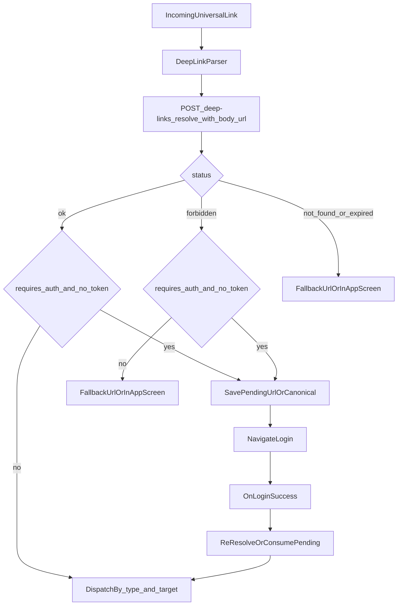

# Flutter Deep Linking Implementation Plan

## Confirmed Decisions
- Implementation follows backend **API Contract V1** (see section below): same canonical URLs, resolver request/response fields, status semantics, and analytics payload.
- Resolver response `type` plus optional `target` (when present) drives screen selection (e.g. supermarket vs restaurant product); Flutter does not infer subtype from URL alone.
- Auth is **optional** on resolver (`auth:sanctum` improves private decisions). Client sends `Authorization: Bearer` when token exists.
- Mixed navigation rules:
  - `status == ok`: navigate using `type` + `id`/`slug` + `target` (and `requires_auth`: if true and no token, pending link + login; if token, navigate).
  - `status == forbidden` with `requires_auth == true` (e.g. private group order): treat like auth-gated — pending link + login if no token; if token, re-resolve or show in-app fallback per product rules.
  - `not_found` / `expired` / other `forbidden`: use `fallback_url` (open in-app WebView or external browser) or dedicated fallback screen; avoid silent failure.
- Short links `https://app.dllni.com/s/{code}` are supported: pass full URL to resolve; backend returns standard metadata.

## Backend API Contract V1 (source of truth)

Reference: user-provided `API_CONTRACT_V1_DEEP_LINKS.md`.

### Canonical URLs (incoming)
- `https://app.dllni.com/product/{id}`
- `https://app.dllni.com/restaurant/{id-or-slug}`
- `https://app.dllni.com/vote/{id}`
- `https://app.dllni.com/group-order/{id-or-slug}`
- `https://app.dllni.com/s/{code}` (short; resolves to canonical target)

### Resolver
- **POST** `/api/v1/deep-links/resolve`
- **Body:** `{ "url": "<full incoming url>" }`
- **Auth:** optional; attach Bearer token when available.

**Success body (shape):** `type`, `id`, `slug`, `status`, `requires_auth`, `canonical_url`, `fallback_url`, and **`target`** when present (per contract notes for Flutter).

**Status values:** `ok` | `not_found` | `forbidden` | `expired`

**HTTP errors:** `422` validation (invalid/missing `url`). Business outcomes use `200` + `status` in body.

### Analytics (server)
- **POST** `/api/v1/deep-links/events`
- **Body:** `action`, `url`, `source`, `medium`, `campaign`, `sharer_id`, `platform` (see contract)
- Preserve UTM/query params when forwarding events from the app.

## Current Code Anchors
- App bootstrap and global navigator key: [D:/my_projects/dllni_com/dllni-user-app/lib/main.dart](D:/my_projects/dllni_com/dllni-user-app/lib/main.dart)
- Auth gate + app root navigation: [D:/my_projects/dllni_com/dllni-user-app/lib/app.dart](D:/my_projects/dllni_com/dllni-user-app/lib/app.dart)
- Route switch/typed route args: [D:/my_projects/dllni_com/dllni-user-app/lib/generated/app_routes.g.dart](D:/my_projects/dllni_com/dllni-user-app/lib/generated/app_routes.g.dart)
- Existing payload->route pattern to reuse: [D:/my_projects/dllni_com/dllni-user-app/common_package/lib/helpers/notification_helper.dart](D:/my_projects/dllni_com/dllni-user-app/common_package/lib/helpers/notification_helper.dart)
- Login success hook for pending-link resume: [D:/my_projects/dllni_com/dllni-user-app/lib/features/auth/view/screens/login_screen.dart](D:/my_projects/dllni_com/dllni-user-app/lib/features/auth/view/screens/login_screen.dart)

## End-to-End Flow


## Step-by-Step Implementation
1. Add deep-link runtime dependency in [D:/my_projects/dllni_com/dllni-user-app/pubspec.yaml](D:/my_projects/dllni_com/dllni-user-app/pubspec.yaml) (recommend `app_links`).
2. Add Android App Links `VIEW` intent-filter + `autoVerify` in [D:/my_projects/dllni_com/dllni-user-app/android/app/src/main/AndroidManifest.xml](D:/my_projects/dllni_com/dllni-user-app/android/app/src/main/AndroidManifest.xml) for host `app.dllni.com` and paths `/product/*`, `/restaurant/*`, `/vote/*`, `/group-order/*`, `/s/*` (short links).
3. Add iOS Associated Domains capability and create [D:/my_projects/dllni_com/dllni-user-app/ios/Runner/Runner.entitlements](D:/my_projects/dllni_com/dllni-user-app/ios/Runner/Runner.entitlements), then wire it in Xcode project settings.
4. Create `core/deeplink` module with:
   - `deep_link_models.dart` (parsed uri, resolver result, link type enum)
   - `deep_link_parser.dart` (validate host/path/query)
   - `deep_link_remote_data_source.dart`: `POST` to `/api/v1/deep-links/resolve` with `{ url }` (DioNetwork + `HandlingApiManager`); optional `POST` `/api/v1/deep-links/events` for server analytics; Bearer attached automatically via existing interceptor when token exists.
   - `deep_link_dispatcher.dart`: map resolver `type` + optional `target` + ids to existing named routes in [D:/my_projects/dllni_com/dllni-user-app/lib/generated/app_routes.g.dart](D:/my_projects/dllni_com/dllni-user-app/lib/generated/app_routes.g.dart) (e.g. `/product` + `SmProductDetailsScreenArgs`, `/rs_product` + `ProductDetailsScreenParams`, `/rs_store`, `/votefollowup`, `/group-order/followup`).
   - `deep_link_service.dart` (cold + warm stream handling, dedupe, auth gate, pending-link resume, fallback).
5. Register deeplink services in DI at [D:/my_projects/dllni_com/dllni-user-app/lib/core/di/injection.dart](D:/my_projects/dllni_com/dllni-user-app/lib/core/di/injection.dart).
6. Initialize deep-link service at app startup in [D:/my_projects/dllni_com/dllni-user-app/lib/main.dart](D:/my_projects/dllni_com/dllni-user-app/lib/main.dart) with `navigatorKey`.
7. Add auth-aware pending-link behavior:
   - If `requires_auth` is true and token is absent, **or** `status == forbidden` with `requires_auth == true` and no token: persist the **full incoming URL** (or `canonical_url` from the last successful parse) and navigate to `/login`.
   - After successful login, **re-call** `POST /api/v1/deep-links/resolve` with the same `url` (Bearer now attached) and then dispatch; clears private `forbidden` cases that become `ok` after auth.
   - Implement in [D:/my_projects/dllni_com/dllni-user-app/lib/features/auth/view/screens/login_screen.dart](D:/my_projects/dllni_com/dllni-user-app/lib/features/auth/view/screens/login_screen.dart) (and/or `DeepLinkService.resumePendingIfAny`).
8. Fallback handling: use response `fallback_url` for web/store landing when `status` is not navigable; optional in-app screen for consistent UX. Handle `422` from resolver (malformed URL).
9. Analytics: call `POST /api/v1/deep-links/events` with parsed UTM/query (`source`, `medium`, `campaign`, `sharer_id`) and `platform` (`android`/`ios`); optionally keep lightweight local logging for debugging.
10. Add tests for parser, dispatcher mapping, cold/warm handling, and login-resume flow.

## Exact File-Level Changes
- Update: [D:/my_projects/dllni_com/dllni-user-app/pubspec.yaml](D:/my_projects/dllni_com/dllni-user-app/pubspec.yaml)
- Update: [D:/my_projects/dllni_com/dllni-user-app/android/app/src/main/AndroidManifest.xml](D:/my_projects/dllni_com/dllni-user-app/android/app/src/main/AndroidManifest.xml)
- Add: [D:/my_projects/dllni_com/dllni-user-app/ios/Runner/Runner.entitlements](D:/my_projects/dllni_com/dllni-user-app/ios/Runner/Runner.entitlements)
- Update: [D:/my_projects/dllni_com/dllni-user-app/ios/Runner/Info.plist](D:/my_projects/dllni_com/dllni-user-app/ios/Runner/Info.plist) (if needed for custom scheme fallback)
- Update: [D:/my_projects/dllni_com/dllni-user-app/lib/main.dart](D:/my_projects/dllni_com/dllni-user-app/lib/main.dart)
- Update: [D:/my_projects/dllni_com/dllni-user-app/lib/app.dart](D:/my_projects/dllni_com/dllni-user-app/lib/app.dart)
- Update: [D:/my_projects/dllni_com/dllni-user-app/lib/features/auth/view/screens/login_screen.dart](D:/my_projects/dllni_com/dllni-user-app/lib/features/auth/view/screens/login_screen.dart)
- Update: [D:/my_projects/dllni_com/dllni-user-app/lib/core/di/injection.dart](D:/my_projects/dllni_com/dllni-user-app/lib/core/di/injection.dart)
- Add folder/files: [D:/my_projects/dllni_com/dllni-user-app/lib/core/deeplink/](D:/my_projects/dllni_com/dllni-user-app/lib/core/deeplink/)
- Add tests: [D:/my_projects/dllni_com/dllni-user-app/test/core/deeplink/](D:/my_projects/dllni_com/dllni-user-app/test/core/deeplink/)

## Essential Snippets To Implement
```dart
// main.dart: initialize app-level deep link listener once DI is ready.
final deepLinkService = getIt<DeepLinkService>();
await deepLinkService.init(navigatorKey: navigatorKey);
```

```dart
// login_screen.dart: consume pending link after successful token save.
await SharedPreferencesHelper.saveData(key: 'token', value: token);
await getIt<DeepLinkService>().resumePendingIfAny();
```

```dart
// deep_link_remote_data_source.dart: contract-aligned resolve.
await dioNetwork.postData(endPoint: '/api/v1/deep-links/resolve', data: {'url': incomingUri.toString()});

// deep_link_dispatcher.dart: type + target drives screen (pseudocode).
switch (resolved.type) {
  case 'product':
    if (resolved.target == 'restaurant') return RouteTarget('/rs_product', ProductDetailsScreenParams(...));
    return RouteTarget('/product', SmProductDetailsScreenArgs(productId: resolved.id));
  case 'restaurant': return RouteTarget('/rs_store', StoreDetailsScreenParams(restaurantId: ..., preview: ...));
  case 'vote': return RouteTarget('/votefollowup', VoteFollowupScreenParams(voteId: resolved.id));
  case 'group-order': return RouteTarget('/group-order/followup', GroupOrderFollowupScreenParams(groupOrderId: resolved.id));
}
```

## Android/iOS Config Snippets
- Android: add `intent-filter` with `android.intent.action.VIEW`, categories `DEFAULT` + `BROWSABLE`, `android:autoVerify="true"`, and `<data android:scheme="https" android:host="app.dllni.com" />` plus path prefixes for product, restaurant, vote, group-order, and `/s/`.
- iOS: add `com.apple.developer.associated-domains` with `applinks:app.dllni.com` in `Runner.entitlements`.
- Host `assetlinks.json` / `apple-app-site-association` on `app.dllni.com` per deployment checklist in the contract (coordinate with backend/DevOps).

## Tests And Run Commands
- `flutter test test/core/deeplink`
- `flutter test`
- `flutter analyze`

## Final Verification Checklist
- Cold start deep link opens correct screen for each type.
- Warm/background deep link opens correct screen without duplicate navigation.
- Logged-out protected link stores pending payload, navigates login, resumes after login.
- Auth-required links with valid token resolve directly to goal screen without login bounce.
- Invalid/forbidden/expired links show fallback or open `fallback_url` as specified.
- Resolver returns match contract; `forbidden` + `requires_auth` triggers login when appropriate.
- Short link `/s/{code}` opens same flow as canonical after resolve.
- Server analytics events POST succeeds with UTM preserved.
- Android App Links verified and iOS Universal Links open app directly.