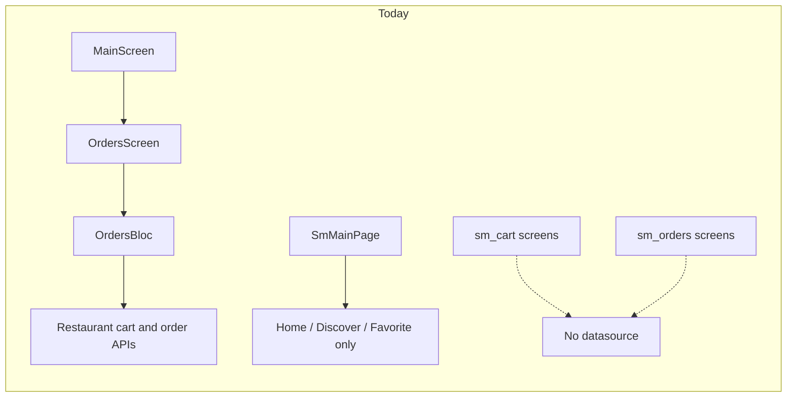
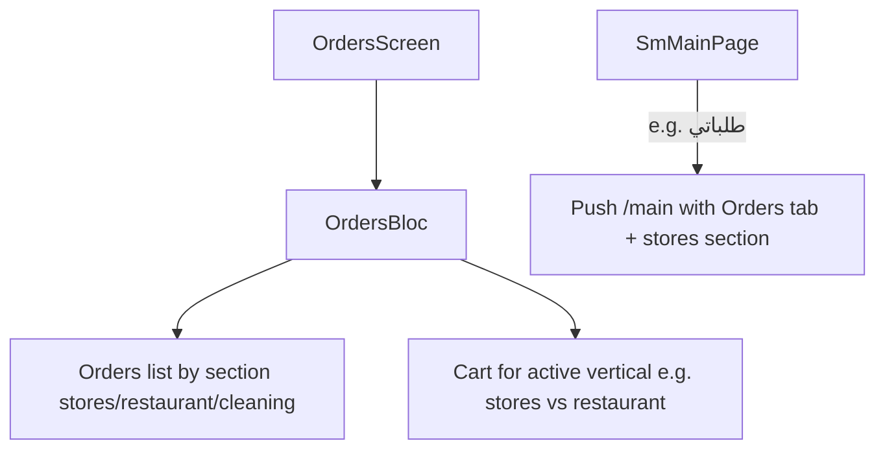

# Connect orders, sm_orders, and sm_cart (unified Orders)

## Current state (analysis)

### [`lib/features/orders`](lib/features/orders) — production slice (restaurant)
- **Shell**: [`MainScreen`](lib/features/main/view/screens/main_screen.dart) tab 1 hosts [`OrdersScreen`](lib/features/orders/view/screens/orders_screen.dart), which provides [`OrdersBloc`](lib/features/orders/view/manager/bloc/orders_bloc.dart) and loads **orders** + **restaurant cart** on entry.
- **List**: [`OrdersListTab`](lib/features/orders/view/widgets/orders_list_tab.dart) uses a segment control: **Cart** → [`OrdersShoppingListTab`](lib/features/orders/view/widgets/orders_shopping_list_tab.dart) → [`RestaurantCartCheckoutBody`](lib/features/orders/view/widgets/restaurant_cart_checkout_body.dart) (Bloc-driven); **Orders** → [`OrdersListBody`](lib/features/orders/view/widgets/orders_list_body.dart).
- **Sections**: Bloc already defines three order-list sections: `stores`, `restaurant`, `cleaning` ([`orders_bloc.dart`](lib/features/orders/view/manager/bloc/orders_bloc.dart) `_sections`). [`OrdersAppBar`](lib/features/orders/view/widgets/orders_app_bar.dart) switches section and refetches orders.
- **APIs** (restaurant): Implemented in [`OrdersRemoteDataSource`](lib/features/orders/data/source/orders_remote_data_source.dart) — e.g. `GET /api/v1/user/orders`, `GET /api/v1/user/restaurants/cart`, `POST /api/v1/user/restaurants/orders`, cart item PATCH/DELETE, coupon check.
- **Gap**: Cart pipeline is **only** restaurant (`FetchRestaurantCartEvent`, `restaurantCart` in [`OrdersState`](lib/features/orders/view/manager/bloc/orders_state.dart)). The **orders list** for `stores` still navigates via [`RestaurantOrderCard`](lib/features/orders/view/widgets/restaurant_order_card.dart) → [`/restaurant-order-tracking`](lib/features/orders/view/widgets/orders_list_body.dart), so the UI is restaurant-shaped even when the section is `stores`.

### [`lib/features/sm_cart`](lib/features/sm_cart)
- Routed screens: `/cart`, `/cart_details`, `/late_time` ([`app_routes.g.dart`](lib/generated/app_routes.g.dart)).
- [`SmCartBloc`](lib/features/sm_cart/view/manager/bloc/sm_cart_bloc.dart) is a **TODO stub**; [`sm_cart_remote_data_source.dart`](lib/features/sm_cart/data/source/sm_cart_remote_data_source.dart) is **empty**. UI widgets mirror checkout concepts (coupon, summary) but are **not** bound to real data.

### [`lib/features/sm_orders`](lib/features/sm_orders)
- Screens: list ([`SmOrdersScreen`](lib/features/sm_orders/view/screens/sm_orders_screen.dart)), details (`/order_details`), tracking (`/order_tracking`). [`SmOrdersBloc`](lib/features/sm_orders/view/manager/bloc/sm_orders_bloc.dart) is a **TODO stub**; [`SmOrdersRemoteDataSource`](lib/features/sm_orders/data/source/sm_orders_remote_data_source.dart) is an **empty** class.
- [`SmMainPage`](lib/features/sm_main_page.dart) has the orders tab **commented out**; SM navigation does not yet surface “my orders” in the bottom bar.

### Cross-link already present
- [`sm_orders/view/widgets/summary_request.dart`](lib/features/sm_orders/view/widgets/summary_request.dart) imports [`SmCartScreen`](lib/features/sm_cart/view/screens/sm_cart_screen.dart) — a UI dependency from SM orders toward SM cart, without shared state.

## Target architecture (your choice: unified Orders)

Keep **one** cart + orders experience in [`OrdersScreen`](lib/features/orders/view/screens/orders_screen.dart), extended so the **`stores`** vertical behaves like **`restaurant`** for data and navigation: load the correct cart when the cart segment is shown, place order against the correct endpoint, and open the correct tracking/details route for `stores` orders.

## Prerequisites (must confirm with backend)

- **Exact REST paths and JSON** for supermarket/stores: cart GET, item update/delete, place order, order details, tracking — and whether they mirror restaurant DTOs or differ.
- If shapes differ: either add **parallel models** under [`orders/data/models`](lib/features/orders/data/models/orders_api_models.dart) (or a new file) or map responses into a **shared UI model** used by checkout widgets.

## Implementation plan

### 1. Data layer — extend `orders`, not empty `sm_*` datasources
- Add store/supermarket methods to [`OrdersRemoteDataSource`](lib/features/orders/data/source/orders_remote_data_source.dart) (and matching repo + use cases) following the same pattern as [`fetchRestaurantCart`](lib/features/orders/data/source/orders_remote_data_source.dart) / [`placeRestaurantOrder`](lib/features/orders/data/source/orders_remote_data_source.dart).
- Register use cases in DI next to existing order use cases ([`injection.config.dart`](lib/core/di/injection.config.dart) is generated from injectable annotations).

### 2. `OrdersBloc` — vertical-aware cart and place-order
- Introduce a clear notion of **which vertical owns the cart UI** (recommended: derive from `selectedTabIndex` / section: `stores` vs `restaurant`; treat `cleaning` when product defines it).
- Add parallel state fields (e.g. `storesCart`, `storesCartStatus`, and parallel coupon/place-order status if APIs require it) **or** a discriminated union pattern — avoid duplicating logic four times; extract private handlers “per vertical” if needed.
- Dispatch **FetchCart** when switching to cart segment **or** when section changes (same as today’s `FetchRestaurantCartEvent` on segment change in [`orders_list_tab.dart`](lib/features/orders/view/widgets/orders_list_tab.dart)).
- **Place order**: branch `PlaceRestaurantOrderEvent` (or rename to generic `PlaceOrderEvent`) to call the correct use case based on active section.

### 3. UI — reuse restaurant checkout pattern for stores
- Add a **`StoresCartCheckoutBody`** (name flexible) alongside [`RestaurantCartCheckoutBody`](lib/features/orders/view/widgets/restaurant_cart_checkout_body.dart), reusing structure (empty/loading/error, lines, coupon, notes, fulfillment) but bound to `stores` state. Optionally refactor shared pieces into private widgets used by both.
- Update [`OrdersShoppingListTab`](lib/features/orders/view/widgets/orders_shopping_list_tab.dart) to show **restaurant** vs **stores** body based on `OrdersBloc` section (same segment index, different child).

### 4. Orders list — section-correct navigation and labels
- Replace or parameterize [`RestaurantOrderCard`](lib/features/orders/view/widgets/restaurant_order_card.dart) so **copy and navigation** depend on `state.selectedTabIndex` / order type: e.g. `stores` → tracking/details route for supermarket (new args + screen, or reuse a generic tracking screen with section in args).
- Today [`orders_list_body.dart`](lib/features/orders/view/widgets/orders_list_body.dart) always pushes [`RestaurantOrderTrackingArgs`](lib/features/orders/view/screens/restaurant_order_tracking_screen.dart); this must branch for `stores` (and optionally `cleaning`).

### 5. Entry from SM (`SmMainPage`)
- Add a **“طلباتي”** (or cart) action that navigates to **unified** flow: e.g. `context.pushRoute('/main', arguments: <tab index for orders>)` and pass **initial section** — requires extending [`MainScreen`](lib/features/main/view/screens/main_screen.dart) / [`OrdersScreen`](lib/features/orders/view/screens/orders_screen.dart) constructor args (similar to `returnedIndex`) so the bloc starts with `selectedTabIndex` for `stores` and optional cart-vs-orders segment index.
- Regenerate routes if you add a typed args class for `/main` (today only `int?` in [`app_routes.g.dart`](lib/generated/app_routes.g.dart)).

### 6. Fate of `sm_cart` / `sm_orders`
- **Short term**: Keep routes if other code deep-links to `/cart` or `/order_details`; implement them as **thin redirects** to `OrdersScreen` with the right args, **or** leave as design-only until unified flow is stable.
- **Long term**: Move any unique layout from SM screens into `orders` widgets to avoid two sources of truth; delete or shrink stub [`SmCartBloc`](lib/features/sm_cart/view/manager/bloc/sm_cart_bloc.dart) / [`SmOrdersBloc`](lib/features/sm_orders/view/manager/bloc/sm_orders_bloc.dart) if unused.

## Risk / complexity notes
- **Two carts**: If users can have both restaurant and supermarket carts, a single “Cart” segment tied only to the **current section** may confuse users switching sections; product should confirm whether one active vertical at a time is acceptable (matches current UX pattern).
- **Naming**: `OrdersBloc` is already mixed “all sections” + “restaurant-only cart”; renaming internal events/state to `*Restaurant*` vs `*Stores*` improves maintainability as you add branches.
