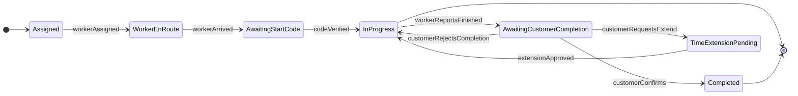
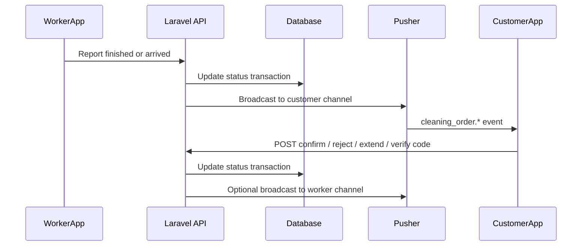

# Backend: cleaning order real-time flows (customer app)

**Stack:** Laravel API + **Laravel Broadcasting** with the **Pusher** driver (compatible with the Flutter user app’s existing Pusher Channels client, same pattern as votes).

This document describes what the **backend** team should implement so the **customer** mobile app can:

1. Receive **real-time signals** when a cleaning worker changes state in ways that require **customer confirmation** or **input**.
2. Expose **authenticated REST endpoints** for the customer to **confirm**, **reject**, **extend time**, or **verify a start code**.

The Flutter app already calls cleaning order REST endpoints; new flows need **broadcast events** and likely **new routes** (or a clearly documented `action` on an existing resource). Coordinate enum names and payloads with mobile before shipping.

**Related docs:** [backend-deep-links.md](./backend-deep-links.md) (unrelated feature, same audience).

---

## 1. Mobile app context (existing)

| Area | Notes |
|------|--------|
| Cleaning orders REST | `GET /api/v1/user/cleaning/orders`, `GET /api/v1/user/cleaning/orders/{id}`, `PATCH /api/v1/user/cleaning/orders/{id}`, `POST .../cancel` — see `OrdersRemoteDataSource` in `lib/features/orders/data/source/orders_remote_data_source.dart`. |
| Patch body today | `PATCH` is used for **reschedule / property-style updates** via `PatchCleaningOrderParams` in `lib/features/orders/domain/usecases/patch_cleaning_order_use_case.dart`. **Do not overload** that payload for the flows below without versioning; prefer **dedicated routes** or an explicit `action` discriminator. |
| Order `status` | Parsed as a string on `CleaningOrderDetailModel` / `CleaningOrderModel` in `lib/features/orders/data/models/cleaning_orders_api_models.dart`. Backend should publish a **single canonical** set of `status` values (extend if needed). |
| Success shape | Many order mutations parse `{ "message": "..." }` via `OrdersActionResultModel` in `lib/features/orders/data/models/orders_api_models.dart`. New endpoints should return a similar envelope where practical (`message` + optional `data`). |
| Real-time precedent | Group vote follow-up uses **Pusher** private channels + auth in `lib/features/profile/view/screens/vote_followup_screen.dart`. Cleaning broadcasts should follow the **same auth and cluster** conventions unless you standardize a new channel naming scheme. |

---

## 2. Summary table

| Flow | Who triggers | Customer UI | Real-time (to customer) | Write API (customer) | Resulting state (proposal) |
|------|----------------|-------------|-------------------------|----------------------|----------------------------|
| **A — Completion confirmation** | Worker marks work finished, pending customer | Modal: extend time / confirm done / not done yet | Event: awaiting customer completion | POST confirm, reject, or request extension | `COMPLETED`, `IN_PROGRESS` (reopened), or `TIME_EXTENSION_REQUESTED` / billing-pending |
| **B — Start verification** | Worker arrives / requests start | Modal: enter **4-digit** security code from worker | Event: awaiting start verification | POST verify code | `IN_PROGRESS` (work started) on success |

---

## 3. Flow A — Worker finished; customer must confirm

### 3.1 UX reference (customer)

- **Title / message (Arabic):** e.g. “مقدم الخدمة قد انهى المهمة يرجى التأكيد” — the provider has finished the task; please confirm.
- **Actions:**
  1. **Extend time** — “أرغب في تمديد الوقت” (real-time intent: customer asks to extend scheduled/slot time; pricing is a product decision).
  2. **Confirm completion** — “نعم، أؤكد انتهاء العمل”.
  3. **Reject completion** — “لا، العمل لم ينته بعد” (work is not finished yet).

### 3.2 Backend behavior

1. Worker app completes its step → persist transition to a state such as **`AWAITING_CUSTOMER_COMPLETION`** (name is illustrative).
2. **Broadcast** to the **order’s customer** only (see [§6](#6-broadcasting--channels-laravel)).
3. Customer taps an action → **authenticated POST** → validate state machine → update DB → optionally broadcast to worker app (see [§9](#9-open-questions-for-product--backend)).

### 3.3 Suggested REST (examples — backend may adjust)

Use namespaced routes under the existing API prefix, e.g.:

- `POST /api/v1/user/cleaning/orders/{id}/completion/confirm`
- `POST /api/v1/user/cleaning/orders/{id}/completion/reject`
- `POST /api/v1/user/cleaning/orders/{id}/completion/extend-time`  
  Body (example): `{ "additional_minutes": 30 }` or `{ "new_end_at": "..." }` (ISO 8601) — **product to fix**.

**Responses:** Prefer `{ "message": "..." }` and optional `data: { "status": "...", "order": { ... } }` so the app can refresh details.

**Idempotency:** If the order is already **`COMPLETED`**, `confirm` should return **200** with a stable message or **409** with a clear code — pick one and document it. Reject/extend should fail if not in **`AWAITING_CUSTOMER_COMPLETION`**.

### 3.4 Suggested broadcast event (customer)

| Field | Description |
|-------|-------------|
| Suggested name | `cleaning_order.awaiting_customer_completion` (use `broadcastAs()` in Laravel if you override the default). |
| Payload (minimum) | `cleaning_order_id`, `worker_id`, `status`, optional `expires_at` if the confirmation window is time-limited. |

---

## 4. Flow B — Worker arrival; customer verifies 4-digit code

### 4.1 UX reference (customer)

- **Title (Arabic):** “أدخل رمز الأمان لتأكيد بدء العمل”.
- **Body:** Security code comes from the worker; do not start if the worker does not give the code.
- **Input:** **4 digits** (PIN-style).

### 4.2 Backend behavior

1. Worker arrives (or equivalent) → persist **`AWAITING_START_VERIFICATION`** (illustrative).
2. Server generates a **4-digit numeric code** bound to **`(cleaning_order_id, worker_id)`** with a **TTL**; store a **hash** (e.g. bcrypt/argon) or HMAC secret comparison — avoid logging plaintext codes.
3. Code is delivered to the **worker** (worker app API or worker channel) — **not** returned on `GET` cleaning order details for the customer.
4. **Broadcast** to customer: show the verification modal (`cleaning_order.awaiting_start_verification`).
5. Customer submits code → **`POST` verify** → on match, transition to **`IN_PROGRESS`** (or your canonical “started” status) and broadcast as needed.

### 4.3 Suggested REST

- `POST /api/v1/user/cleaning/orders/{id}/start-verification/confirm`  
  Body: `{ "code": "1234" }` — validate with Laravel **Form Request** (`regex:/^[0-9]{4}$/`, `required`).

**Rate limiting:** Apply **strict** `throttle` middleware (per user + per order id if possible). After N failures, temporary lockout or require support — document limits in API error responses (`429`, structured `errors`).

### 4.4 Suggested broadcast event (customer)

| Field | Description |
|-------|-------------|
| Suggested name | `cleaning_order.awaiting_start_verification` |
| Payload (minimum) | `cleaning_order_id`, `worker_id`, `status`. **Do not** include the code. |

---

## 5. Order state machine (proposal)

Statuses are **illustrative** — align with existing `status` strings in production and extend only when needed.

**Actors:**

- **Worker:** transitions into `AwaitingStartCode`, `AwaitingCustomerCompletion`.
- **Customer:** code verification, confirm/reject/extend.
- **System / admin / cron:** may handle extension approval or timeouts (not specified here).

---

## 6. Broadcasting & channels (Laravel)

**Goal:** Only the **customer who owns the order** receives private order updates.

### 6.1 Implementation notes

- Use Laravel events implementing **`ShouldBroadcast`** / **`ShouldBroadcastNow`**. Dispatch **after** the database transaction commits so Pusher never sees stale state.
- Use **`PrivateChannel`**, e.g. `private-user.{customer_id}` **or** `private-cleaning-order.{id}` with authorization that checks the authenticated user owns the order.
- Authorize in **`routes/channels.php`** (e.g. `Broadcast::channel('private-user.{id}', …)`).
- Configure **`broadcastAs()`** so the Flutter client can subscribe to predictable event names (e.g. `cleaning_order.awaiting_start_verification`).
- **Queues:** Default **queued** broadcast is acceptable unless you require sub-second latency; then document **`ShouldBroadcastNow`** and operational requirements (workers, retries).

### 6.2 Pusher auth

Mirror the **existing** mobile pattern (vote screen): authenticated **POST** to Laravel’s broadcasting auth endpoint so the client can subscribe to **private** channels. Ensure **same Pusher app key/cluster** as other features or document a dedicated app if you split environments.

---

## 7. Sequence (high level)

---

## 8. Security and audit

- All customer endpoints: **auth middleware** (Sanctum/Passport/etc. — your existing API stack).
- **Authorize** every action: `auth()->id()` must be the **customer** on the cleaning order.
- **Never** return the start code in customer **GET** responses.
- Log **verification attempts** (order id, outcome, timestamp); avoid storing raw submitted codes in plain text in logs.
- **CORS** and **broadcasting auth** must match how the mobile app already authenticates to the API.

Optional: append-only **`cleaning_order_events`** table (`order_id`, `type`, `meta` JSON, `created_at`) for disputes and support.

---

## 9. Open questions for product / backend

1. **Extend time:** Pricing, payment capture, and whether extension requires **admin approval** or is automatic within limits.
2. **Reject completion:** Does the job return to **`IN_PROGRESS`** with the same worker? Escalation? Partial refunds?
3. **Worker app:** Should workers receive **real-time** events when the customer confirms, rejects, or verifies the code (separate private channel per worker or per order)?
4. **Timeouts:** What happens if the customer never responds while in **`AWAITING_CUSTOMER_COMPLETION`** or never enters the code?
5. **Status strings:** Final enum list and whether to expose them in `GET /api/v1/user/cleaning/orders/{id}` for the UI to poll as a fallback when Pusher is disconnected.

---

## 10. Deliverable checklist (backend)

- [ ] Channel naming + `channels.php` authorization.
- [ ] Broadcast event classes + documented **client event names** and JSON payloads.
- [ ] REST routes + Form Requests + throttling for verify-code and sensitive actions.
- [ ] DB transactions around status changes + broadcast.
- [ ] Documented **status** values for cleaning orders (aligned with mobile models).
- [ ] Agreed error codes / HTTP status for invalid state, wrong code, and rate limits.
